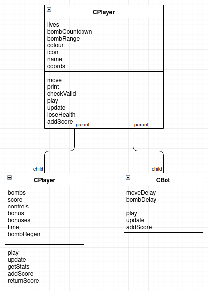
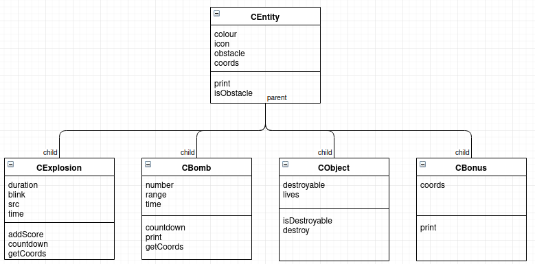

# Bomberman

This was the semestral project for the Programming and Algorithmics 2 course.

## Overview

This project uses `STL` and `ncurses` to create the game “Bomberman” where the objective is to obtain the highest score on a map before the computer kills you. This can be played in both Singleplayer and Co-op gamemodes.

Player names, maps can be selected from the settings menu by inputting strings which will either be the new nickname, or relative path to the map file.

Bonuses can also be configured in the settings menu. A list of bonuses appears, where the user can configure which bonuses are used and which ones aren't. Green bonuses are used and red bonuses are not.

---

## Project structure

All classes start with the letter “C” and are defined in the same header as their parent class. For example, classes `CHuman` and `CBot` are child classes of `CPlayer`. All three classes will be defined in one header titled `CPlayer.h`. This is to avoid an unnecessarily large number of source files which could cause confusion. In total, there are 2 parent classes: `CPlayer`, which represents anything that can move around and interact with the map, and `CEntity`, which represents all the objects on the map like walls, bombs, explosions, etc.

There are 3 more `.cpp` files (with their corresponding identically named `.h` headers): `map.cpp`, which contains the functions for loading/saving a map from file as well as validating it, `game.cpp`, which contains the main game loop and it's helper functions, and `helpers.cpp`, which contains the random function which generates a random number in a range which is used by multiple classes throughout the program.

Lastly, a Makefile exists with the commands `make compile`, which will compile all the source files in the directory `rybakki1/src/` and store the object files in the directory `rybakki1`. `make all` will link all the object files together into one executable `rybakki1/rybakki1` and compile any missing sources. `make clean` which will delete the file `rybakki1/rybakki1` and any `rybakki1/*.o` files. `make doc` does nothing because the documentation is already included in directory `rybakki1/doc/`.

---

## Testing

directory `rybakki1/examples/` contains some map files, most of which are invalid for one or more reasons and should be rejected. `mapfile` and `mapfile2` are valid files and should be accepted every time.

---

## Dependencies and compilation

This project is only dependent on the `Standard Template Library` and `ncurses`. The program is compiled using the `-lncurses` flag to link the `ncurses` library with the source files.

---

## Class inheritance, polymorphism and virtual methods

### CPlayer:

### CPlayer virtual methods:

`play(map, bmbVec, input)` _(pure virtual)_

*   `CHuman` and `CBot` child classes override this method because they play in different ways.
*   `CHuman` will decide the next move to make based on the `input` parameter
*   `CBot` will decide the next move randomly, so it's code is different for this function.

`update(map)` _(pure virtual)_

*   Again, both child classes need to be updated differently.
*   `CHuman` needs to check for `CExplosion`s and `CBonus`es, as well as constantly update it's bonus
*   `CBot` only needs to check for `CExplosion`s since it cannot collect bonuses.

`addScore(amount)` _(pure virtual)_

*   `CHuman` will add parameter `amount` to it's score
*   However, `CBot` instances do not have a score, so they do nothing for this function.

### CEntity:

### CEntity virtual methods:

`print()`

*   This method is used in most cases by the child classes.
*   However, there are some situations where a small variation of this method is needed.
*   E.g. in class `CBomb` a red number with a yellow background is printed instead
*   E.g. in class `CBonus` a blank “B” character is printed without any attributes.

---

## Final notes

The controls for each player can be changed by editing the `controls0` and `controls1` vectors.

Having more bots on the map simultaneously can be done by changing the `bots.size() < 3` check.

---
